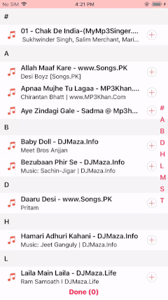
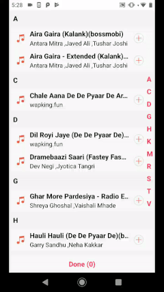

# React Native Music Picker

### Installation and Usage

Please check this blog for installation and usage [this link](https://www.logisticinfotech.com/blog/react-native-music-picker-library/)

 

### Basic Properties

+-----------------------+-----------------+-------------------------+---------------------------------------+
|          Prop         |     Default     |           Type          |              Description              |
+-----------------------+-----------------+-------------------------+---------------------------------------+
| sectionContainerStyle |        {}       |         `style`         | Style of the sticky header container. |
+-----------------------+-----------------+-------------------------+---------------------------------------+
|    sectionTextStyle   |        {}       |         `style`         |       Style of the sticky text.       |
+-----------------------+-----------------+-------------------------+---------------------------------------+
|   itemContainerStyle  |        {}       |         `style`         |   Style of the list item container.   |
+-----------------------+-----------------+-------------------------+---------------------------------------+
|     songTitleStyle    |        {}       |         `style`         |     Style of the song title text.     |
+-----------------------+-----------------+-------------------------+---------------------------------------+
|  songDescriptionStyle |        {}       |         `style`         |     Style of the song description.    |
+-----------------------+-----------------+-------------------------+---------------------------------------+
|  fastScrollTextStyle  |        {}       |         `style`         |     Style of the fast scroll text.    |
+-----------------------+-----------------+-------------------------+---------------------------------------+
|  buttonContainerStyle |        {}       |         `style`         |     Style of the button container.    |
+-----------------------+-----------------+-------------------------+---------------------------------------+
|    buttonTextStyle    |        {}       |         `style`         |       Style of the button text.       |
+-----------------------+-----------------+-------------------------+---------------------------------------+
|    defaultSongIcon    | Icon in library | `object` or `reference` |       Default Icon of the song .      |
+-----------------------+-----------------+-------------------------+---------------------------------------+
|     defaultAddIcon    | Icon in library | `object` or `reference` |          Icon of add button.          |
+-----------------------+-----------------+-------------------------+---------------------------------------+
|    defaultTickIcon    | Icon in library | `object` or `reference` |      Icon when song is selected.      |
+-----------------------+-----------------+-------------------------+---------------------------------------+
|      loaderColor      |    '#F9325E'    |         `string`        |      Color of the default loader.     |
+-----------------------+-----------------+-------------------------+---------------------------------------+
  
